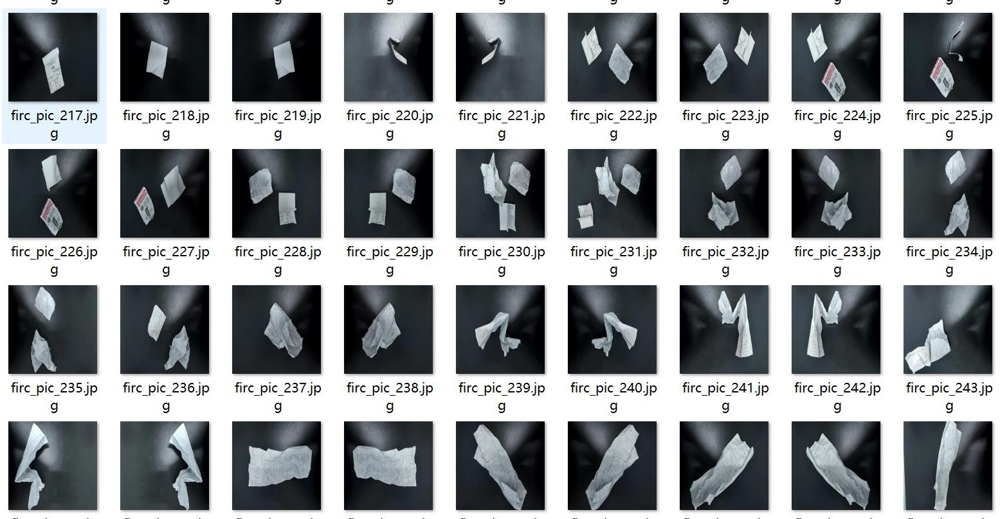
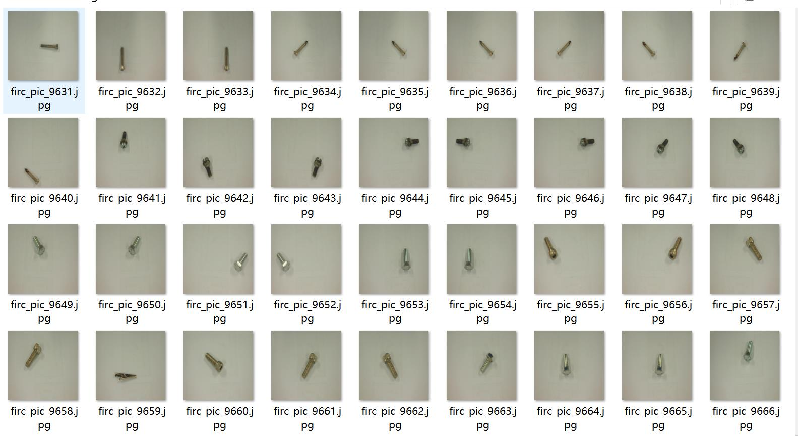
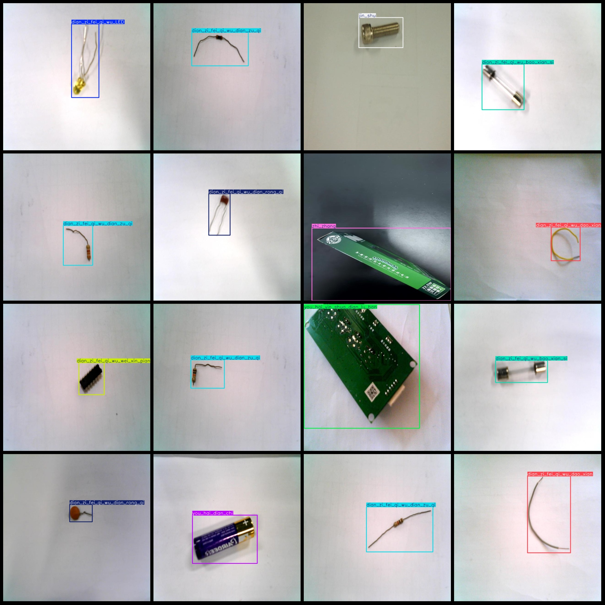
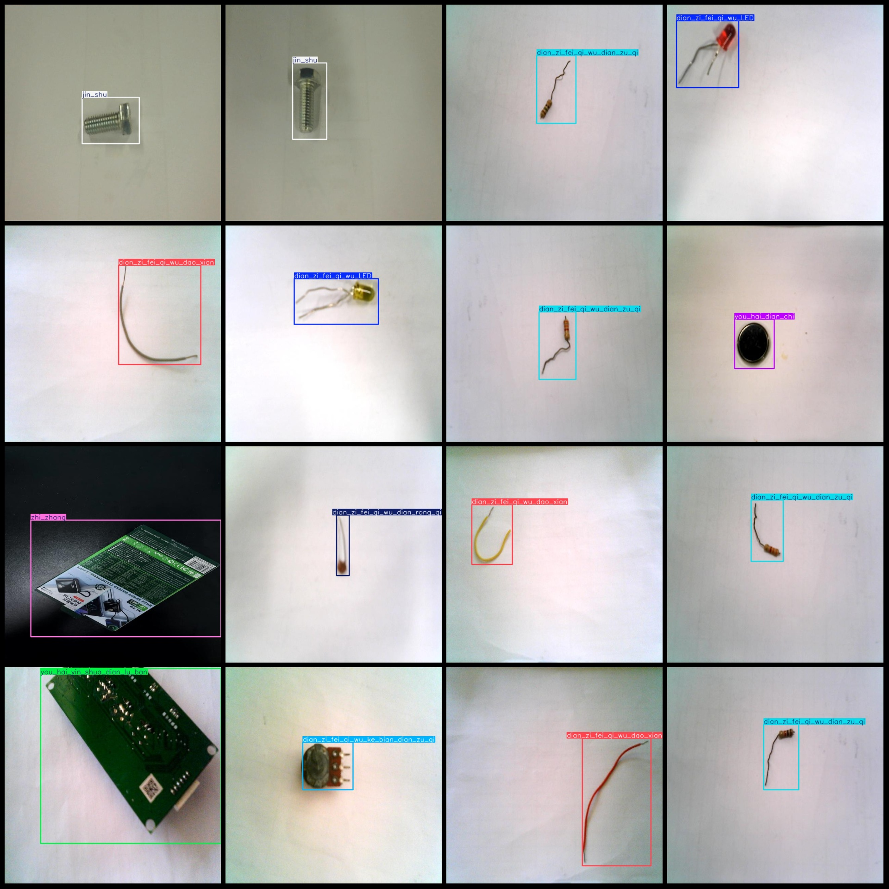

# Electronic Components Waste Detection Dataset VOC+YOLO with 9719 images in 11 categories

Note: The dataset contains approximately 4500 images, all of which are enhanced versions.
Dataset format: Pascal VOC format + YOLO format (txt file without split paths, only containing jpg images along with corresponding VOC format xml files and yolo format txt files).
Number of images (jpg file count): 9719
Number of labels (xml file count): 9719
Number of labels (txt file count): 9719
Number of label categories: 11
Label category names (note that the order of labels in the yolo format does not correspond to this, but is based on the classes.txt in the labels folder): ["dian_zi_fei_qi_wu_LED", "dian_zi_fei_qi_wu_bao_xian_si", "dian_zi_fei_qi_wu_dao_xian", "dian_zi_fei_qi_wu_dian_rong_qi"]
"dian_zi_fei_qi_wu_dian_zu_qi","dian_zi_fei_qi_wu_ke_bian_dian_zu_qi","dian_zi_fei_qi_wu_wei_xin_pian","jin_shu","you_hai_dian_chi","you_hai_yin_shua_dian_lu_ban","zhi_zhang"]  
boxes per class:   
Electronic Waste-LED: Box count = 887, images = 887
Electronic Waste-Battery: Box count = 899, images = 896
Electronic Waste-Wire: Box count = 887, images = 887
Electronic Waste-Capacitor: Box count = 874, images = 874
Electronic Waste-Resistor: Box count = 911, images = 911
Electronic Waste-Variable Resistor: Box count = 910, images = 910
Electronic Waste-Microchip: Box count = 887, images = 887
Metal: Box count = 900, images = 899
Harmful Batteries: Box count = 900, images = 872
Harmful Printed Circuit Boards: Box count = 920, images = 917
Paper: Box count = 917, images = 779
total boxes: 9892  
image resolution: 640x640  
Annotation Tool: labelImg
Annotation Rule: Draw a rectangle around the class.
Important Notes: The dataset does not have split into training, validation, and test sets; you need to manually divide it.
Special Statement: This dataset does not guarantee any accuracy for the trained model or weight file.
Image Preview:
## Images

Here is a pay link on Stripe ( https://buy.stripe.com/3cs8yP7sY87d0vu9AB ). Please contact me lonlonago@foxmail.com after funding $89, and I will send you a complete data files , thank you!

